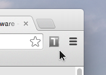
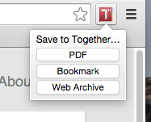

# Together Chrome Extension

This is an extension for Google Chrome that provides a simple interface for saving pages to [Together.app][1]. Pages can be saved to **PDF**, as **bookmarks**, or as **web archives**.

## How does it work? 

The extension is a Browser Action that puts a little icon near your address bar (you can choose where, exactly).

When you click it, a little menu pops up with three buttons, letting you choose how you want to save the web page.

When you click one of these buttons, the extension gets the title and URL of your active tab and builds a Together app URL so that Together can receive the information. This happens in a single tiny invisible IFRAME.

## Does this extension do anything creepy or weird with my information?

**No.** The source code (living in **/src**) is short and straightforward — you can verify for yourself!

## How do I install it?

1. Download the repo.
2. Go to [chrome://extensions](chrome://extensions).
3. Make sure the checkbox next to **Developer mode** is checked.
4. Click **Load unpacked extension…**.
5. Choose the **src** folder of the repo.
6. Check the **Enabled** checkbox.

Pretty easy.

## Is this official?

No. But I really like the Together app, and the only way to save web pages, currently, is to drag bookmarklets to your browser. I'm not a fan of bookmarklets, though. So I spent a little time to make this. Now I've got a handy little icon in a nice, compact package.

## What is *Together*?

It's a really great notebook/documents-management app by a guy named Steve Harris. Or perhaps I should say "a guy *called* Steve Harris," because he's from the UK, and that's how they say it there.

I recently spent about a week trying out a bunch of apps for note- and document management, and Together was my clear favorite. It has a great Yosemite-style UI and has the ability to sort your notes and documents by tags or in a folder hierarchy. Evernote is well-designed and has earned its ubiquity, but it has a limited feature set that restrains the way I like to organize things. Apps like Yep and Leap and Notebooks have a lot more features, but Together has the best combination of everything. I recommend [checking it out][1].

## Can you make one of these for Safari? Or Firefox?

Sure? Drop me a note here, and I'll answer the demand, if there is one.

[1]: http://reinventedsoftware.com/together/
